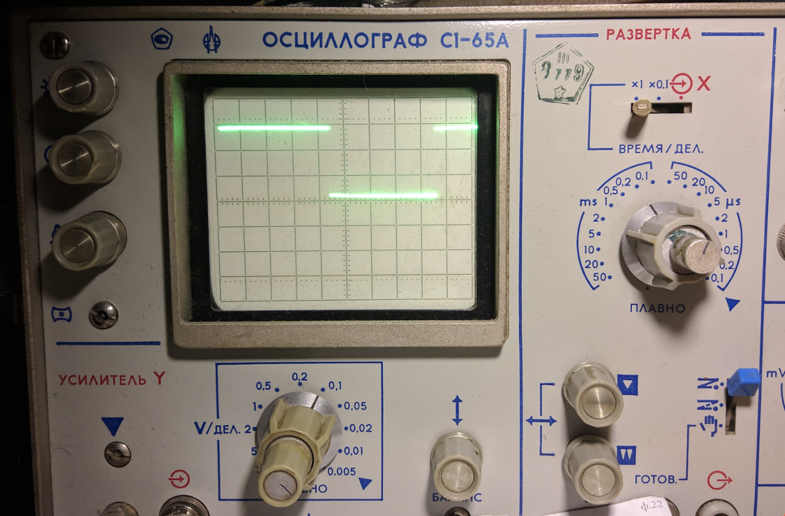

# VT1211 GPIO Kernel module

Модуль ядра Linux для работы с портами GPIO Super I/O контроллера VIA VT1211. Тестирование проводилось на одноплатных компьютерах Avalue ECM-CX700 под Debian GNU/Linux (Stretch), ядро 4.9.0-5-686. Дальнейшее изложение пойдёт в контексте этого компьютера с этим дистрибутивом.

## Сборка и загрузка модуля

Для сборки модуля необходимо установить пакеты build-essential, linux-headers и linux-headers-common для вашего ядра

Пример:
```
# apt install build-essential linux-headers-4.9.0-5-686 linux-headers-4.9.0-5-common
```

Получаем исходники и собираем

```
# cd /usr/src
# git clone https://github.com/manfredmann/vt1211_gpio_k.git
# cd vt1211_gpio_k
# make
```

Параметры модуля

| Параметр | Тип     | Комментарий             | По умолчанию |
| ---------|---------|-------------------------|--------------|
| port_1   | Boolean | Включает PORT 1         | True         |
| port_3_6 | Boolean | Включает порты с 3 по 6 | False        |

Загружаем модуль

```
# insmod vt1211_gpio.ko
# dmesg | tail -n 2
[45075.398517] VT1211: GPIO init
[45075.398569] VT1211: ID: 3C, Revision: 02, Base addr.: 0800
#  ls /dev -la | grep gpio
crw-------  1 root root    254,   0 фев 23 13:31 gpiochip0
```

## Работа с GPIO из Userspace

Есть два варианта:

1. Работа через sysfs (Deprecated и вообще не Ъ)
2. Новый интерефейс: через символьное устройство /dev/gpiochipX (Ъ вариант)

Начиная с версии ядра 4.8 интерфейс sysfs был упразднён. Теперь для работы с устройствами gpio используются символьные устройства. Хотя sysfs и остался для обратной совместимости, его мы рассматривать не будем.

### libgpiod

Библиотека для работы с символьными устройствами gpio. В репозиториях Debian она отсутствует, т.к. появилась совсем недавно. Так что вам придётся собрать её ручками.

[git репозиторий на kernel.org](https://git.kernel.org/pub/scm/libs/libgpiod/libgpiod.git/about/)

Там же вы найдёте документацию.

Вывод утилиты gpioinfo из состава библотеки

```
# gpioinfo 
gpiochip0 - 8 lines:
        line   0: "vt1211_gp10" unused input active-high
        line   1: "vt1211_gp11" unused input active-high
        line   2: "vt1211_gp12" unused input active-high
        line   3: "vt1211_gp13" unused input active-high
        line   4: "vt1211_gp14" unused input active-high
        line   5: "vt1211_gp15" unused input active-high
        line   6: "vt1211_gp16" unused input active-high
        line   7: "vt1211_gp17" unused input active-high
```

Вывод с включёнными портами с 3 по 6

```
# gpioinfo
gpiochip0 - 35 lines:
        line   0: "vt1211_gp10" unused input active-high
        line   1: "vt1211_gp11" unused input active-high
        line   2: "vt1211_gp12" unused input active-high
        line   3: "vt1211_gp13" unused input active-high
        line   4: "vt1211_gp14" unused input active-high
        line   5: "vt1211_gp15" unused input active-high
        line   6: "vt1211_gp16" unused input active-high
        line   7: "vt1211_gp17" unused input active-high
        line   8: "vt1211_gp30" unused input active-high
        line   9: "vt1211_gp31" unused input active-high
        line  10: "vt1211_gp32" unused input active-high
        line  11: "vt1211_gp33" unused input active-high
        line  12: "vt1211_gp34" unused input active-high
        line  13: "vt1211_gp35" unused input active-high
        line  14: "vt1211_gp36" unused input active-high
        line  15: "vt1211_gp37" unused input active-high
        line  16: "vt1211_gp40" unused input active-high
        line  17: "vt1211_gp41" unused input active-high
        line  18: "vt1211_gp42" unused input active-high
        line  19: "vt1211_gp43" unused input active-high
        line  20: "vt1211_gp44" unused input active-high
        line  21: "vt1211_gp45" unused input active-high
        line  22: "vt1211_gp46" unused input active-high
        line  23: "vt1211_gp47" unused input active-high
        line  24: "vt1211_gp50" unused input active-high
        line  25: "vt1211_gp51" unused input active-high
        line  26: "vt1211_gp52" unused input active-high
        line  27: "vt1211_gp53" unused input active-high
        line  28: "vt1211_gp54" unused input active-high
        line  29: "vt1211_gp55" unused input active-high
        line  30: "vt1211_gp56" unused input active-high
        line  31: "vt1211_gp57" unused input active-high
        line  32: "vt1211_gp60" unused input active-high
        line  33: "vt1211_gp61" unused input active-high
        line  34: "vt1211_gp62" unused input active-high
```

### Пример простой программы

А теперь, просто сгенерируем прямоугольник на 1 ноге порта 1.

```Cpp
#include <stdio.h>
#include <gpiod.h>
#include <unistd.h>

int main(int argc, char *argv[]) {
  struct gpiod_chip *chip;
  struct gpiod_line *line;

  chip = gpiod_chip_open("/dev/gpiochip0");
  if (!chip) {
    printf("Couldn't open gpiochip device\n");
    return -1;
  }

  line = gpiod_chip_get_line(chip, 0);
  if (!chip) {
    gpiod_chip_close(chip);
    printf("Couldn't get line 0\n");
    return -1;
  }

  gpiod_line_request_output(line, "azaza", 0);

  while(1) {
    gpiod_line_set_value(line, 1);
    usleep(1000);
    gpiod_line_set_value(line, 0);
    usleep(1000);
  }
  return 0;
}
```

Соберём пример

```
# gcc main.c -lgpiod -o vt1211_test
```

Подключим осциллограф к 1 ноге порта 1. Запустим программу и увидим:



***
# VIA VT1211 Super I/O

Краткое описание работы с контроллером VIA VT1211. Всё что изложено далее являеется скорее дополнением к Datasheet, чем самостоятельным описанием.

[Datasheet](http://www.hardwaresecrets.com/datasheets/vt1211.pdf)

## Общая информация

Контроллер висит на шине LPC. Это такая дремучая шина для подключения всякой низкоскоростной фигни (подробнее в вики). Микра имеет несколько функций:

- Измерение температуры, напряжения, в общем: hardware monitor
- Fan speed controller. Nuff said.
- Другая куча не интересующих нас функций
- Собственно, GPIO.

На борту есть несколько GPIO портов, а именно 7. На колодку выведен самый первый порт. Ноги контроллера имеют по 2 функциональных назначения: собственно GPIO, и например, POWER Led или любая другая «служебная функция» (назовём это так). Всё это богатство настраивается через регистры конфигурации, коих тут over 9k. Прежде чем описывать интересующие нас регистры, разберёмся как эту шнягу конфигурировать.

Шина LPC лежит в адресном пространстве I/O, потому доступ к контроллеру довольно прост.
Для конфигурирования устройства имеется два 8 разрядных регистра:

| Адрес I/O  |                               Назначение |
| ---------- | ---------------------------------------- |
|      002Eh | Configuration Index Register (далее CIR) |
|      002Fh | Configuration Data Register (далее CDR)  |

Регистры конфигурации у VT1211 делятся на два типа:

- Регистры конфигурации SuperIO
- Регистры конфигурации Logical Device Number (далее LDN)

## Алгоритмы конфигурирования
#### Вход в режим конфигурирования

1. Записать в CIR значение 87h
2. Записать в CIR значение 87h

Да, именно 2 раза.

#### Выход из режима конфигурирования

1. Записать в CIR значение AAh

#### Работа с регистрами конфигурации SuperIO

1. Войти в режим конфигурирования
2. Записать в CIR адрес интересующего регистра
3. Прочитать/записать из/в CDR значение
4. Выйти из режима конфигурирования

#### Работа с регистрами LDN
1. Войти в режим конфигурирования
2. Записать в CIR значение 07h
3. Записать в CDR номер LDN (08h, например)
4. Записать в CIR адрес интересующего регистра выбранного LDN
5. Прочитать/записать из/в CDR значение
6. Выйти из режима конфигурирования

## Работа с портами

#### Общий пример конфигурирования порта

1. Remap ног.
2. Выбор в LDN8 нужного порта для конфигурирования.
3. Активация GPIO в LDN8.
4. Чтение базового адреса
5. Конфигурирование разрядов выбранного порта на ввод или вывод
6. Конфигурирование инверсии разрядов выбранного порта

Работа непосредственно с портом представляет собой чтение/запись по прочитанному из LDN базовому адресу+смещение. Про смещение читайте далее.

#### Конфигурирование PORT1

Разберём самый первый порт GPIO, который выведен на колодку. Как было сказано в самом начале, выводы контроллера имеют по 2 назначения. Нужно сделать remap. Для порта 1 это делается в регистре конфигурации «GPIO Port 1 Pin Select»

| Значение |   DB7   |   DB6   |   DB5   |   DB4   |   DB3   |   DB2   |   DB1   |   DB0   |
|----------|---------|---------|---------|---------|---------|---------|---------|---------|
|          | Pin 121 | Pin 122 | Pin 123 | Pin 124 | Pin 125 | Pin 126 | Pin 127 | Pin 128 |
| 0        |   JAB2  |   JBB2  |   JACY  |   JBCY  |   JBCX  |   JACX  |   JBB1  |   JAB1  |
| 1        |   GP17  |   GP16  |   GP15  |   GP14  |   GP13  |   GP12  |   GP11  |   GP10  |

Для того, чтобы ноги с 121 по 128 стали выводами Port 1, необходимо записать в регистр «GPIO Port 1 Pin Select» Значение FFh.

#### Конфигурирование PORT2 (Порты с 2 по 6)

А вот это забавный момент. Регистр называется «GPIO Port 2 Pin Select», но на деле он конфигурирует порты с 2 по 6. Ноги с 66 по 97 по отдельности отремапить нельзя, только все сразу. Собственно, больше говорить тут нечего, всё понятно из таблицы.

Примечание. Несмотря на то, что я пытался ремапить ноги для порта 2, это не работает. Да и как потом с ним работать тоже непонятно, т. к. этого порта нет в адресном пространстве I/O. Дальше я не стал разбираться, ибо портов и так достаточно.

| Значение |      DB7     |           DB6           |    DB5    |   DB4   |   DB3   |   DB2   |   DB1   |   DB0   |
|----------|--------------|-------------------------|-----------|---------|---------|---------|---------|---------|
|          | System reset | Route SMI to serial IRQ | Pin 97-66 | Pin 100 | Pin 101 | Pin 102 | Pin 113 | Pin 115 |
| 0        | Normal operation | Disable | ROM Signal | IRRX1 | COPEN | PLED | FANIO2 | FANOUT2  |
| 1        |   Reset Chip  | Enable | GP25-GP62 |   GP24  |   GP23  |   GP22  |   GP21  |   GP20  |

#### Работа с регистрами LDN8

###### 30h GPIO Activate
В нём просто активируем GPIO

| Значение |   DB7   |   DB6   |   DB5   |   DB4   |   DB3   |   DB2   |   DB1   |      DB0     |
|----------|---------|---------|---------|---------|---------|---------|---------|--------------|
|          |Reserved |Reserved |Reserved |Reserved |Reserved |Reserved |Reserved |GPIO Activate |
| 0        |         |         |         |         |         |         |         | Disable      |
| 1        |         |         |         |         |         |         |         | Enable       |

###### 61-60h GPIO Base Address

Базовый адрес в пространстве I/O

|DB15|DB14|DB13|DB12|DB11|DB10|DB9|DB8|DB7|DB6|DB5|DB4|DB3|DB2|DB1|DB0|
|----|----|----|----|----|----|---|---|---|---|---|---|---|---|---|---|
|BAR |BAR |BAR |BAR |BAR |BAR |BAR|BAR|BAR|BAR|BAR|BAR| 0 | 0 | 0 | 0 |

###### F0h GPIO Port Select

Выбор порта для конфигурирования

|DB7|DB6|DB5|DB4|DB3|DB2|DB1|DB0|
|---|---|---|---|---|---|---|---|
|Reserved|Reserved|Reserved|Reserved|Reserved|Port number|Port number|Port number|

|Значение Port Number|  Порт  |
|--------------------|--------|
| 00h                | PORT 1 |
| 01h                | PORT 3 |
| 02h                | PORT 4 |
| 03h                | PORT 5 |
| 04h                | PORT 6 |

###### F1h GPIO Pin configuration

Настройка пинов порта на ввод или вывод

| Значение |   DB7 |   DB6 |   DB5 |   DB4 |   DB3 |   DB2 |   DB1 |   DB0 |
|----------|-------|-------|-------|-------|-------|-------|-------|-------|
| 0        |  Out  |  Out  |  Out  |  Out  |  Out  |  Out  |  Out  |  Out  |
| 1        |  In   |  In   |  In   |  In   |  In   |  In   |  In   |  In   |

###### F2h GPIO Pin Polarity

Прямой или инвернсый выход

| Значение |    DB7   |     DB6  |    DB5   |     DB4  |     DB3  |     DB2  |    DB1   |    DB0   |
|----------|----------|----------|----------|----------|----------|----------|----------|----------|
| 0        |  Normal  |  Normal  |  Normal  |  Normal  |  Normal  |  Normal  |  Normal  |  Normal  |
| 1        | Inverted | Inverted | Inverted | Inverted | Inverted | Inverted|  Inverted | Inverted |

#### Чтение/запись из/в порт

Тут всё просто. Читаем/пишем по BA+offset в пространстве I/O. Для примера, BA пусть будет 0800h

| BA + offset |  Порт  |
|-------------|--------|
| 0800h + 00h | PORT 1 |
| 0800h + 01h | PORT 3 |
| 0800h + 02h | PORT 4 |
| 0800h + 03h | PORT 5 |
| 0800h + 04h | PORT 6 |
